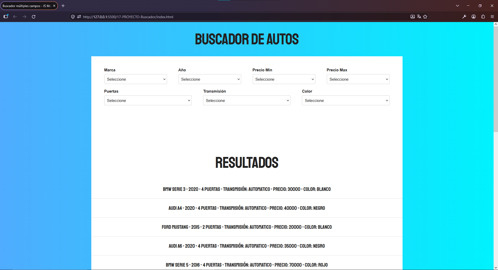

# 🔎 Filtrar y Buscar en base a diferentes Campos

Aplicación web interactiva desarrollada como parte del curso **JavaScript Moderno: Guía Definitiva Construye +10 Proyectos**.

El proyecto permite filtrar y buscar información dinámicamente utilizando diferentes campos y criterios, aplicando JavaScript para manipular los datos y actualizar la interfaz de usuario.

## 🚀 Demo

[Ver proyecto en GitHub Pages]

## 📸 Vista previa



## 🛠️ Tecnologías utilizadas

- HTML5
- CSS3
- JavaScript
- DOM
- Git
- GitHub Pages

## ✨ Funcionalidades

- Visualización dinámica de información.
- Búsqueda mediante diferentes campos.
- Filtrado utilizando múltiples criterios.
- Actualización dinámica de los resultados.
- Combinación de diferentes filtros.
- Interacción con la interfaz mediante JavaScript.

## 🎯 Conceptos de JavaScript aplicados

- Manipulación del DOM.
- Event Listeners.
- Funciones.
- Arrays.
- Objetos.
- Métodos de arrays.
- Filtrado y búsqueda de información.
- Operadores lógicos.
- Condicionales.
- Manipulación dinámica del HTML.

## 📂 Estructura del proyecto

```text
filtrar-buscar-js/
│
├── css/
├── img/
├── js/
├── index.html
├── .gitignore
└── README.md
```

## 🚀 Instalación

Clona el repositorio:

```bash
git clone https://github.com/cristhianychr/filtrar-buscar-js.git
```

Ingresa al proyecto:

```bash
cd filtrar-buscar-js
```

Abre `index.html` en tu navegador.

## 🎓 Curso

Proyecto desarrollado durante el curso:

**JavaScript Moderno: Guía Definitiva Construye +10 Proyectos**

## 👨‍💻 Autor

**Cristhian Chanamé**

Estudiante de Ingeniería de Software.